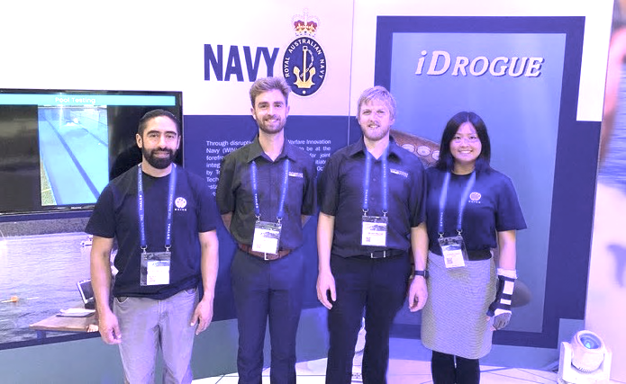

In May 2022, Ocius was at the Sydney International Convention Centre, taking part in the Indo-Pacific 2022 exposition, exhibiting on the convention floor as well as presenting at the associated conferences.  During the event Ocius managed to find time to sign an exclusivity agreement with Thales Australia with regard to ASW USVs.

Along with BEACON and our Ocius stand, the iDrogue team presented as the TAS CRC stand, showcasing their developments in recovering AUVs.

