Successful completion of $5.5M Defence Innovation Hub Ph4 Contract

Contract for further trials in other areas of the EEZ

Exclusive agreement with Thales Success at Autonomous Warrior 2022

Demonstrated Communications Gate Way with both L3 Australia and DSTG

Outperformed competitors in offshore operations

Signed contract with a Japanese oceanographic organisation

Expanded another 250m component assembly and office area at UNSW Randwick Campus

2022 Annual General Meeting 4pm Thursday 24 November

Slideshow
---------

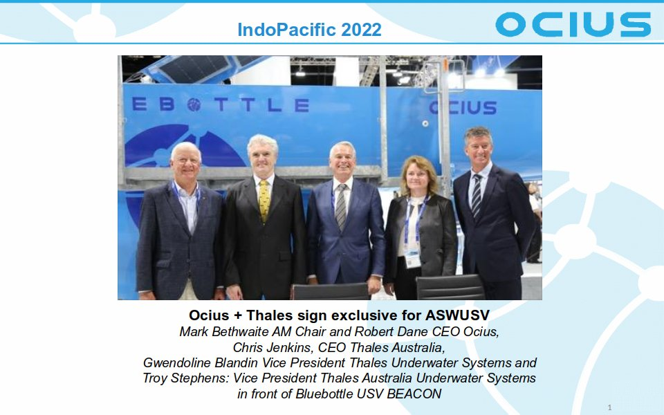

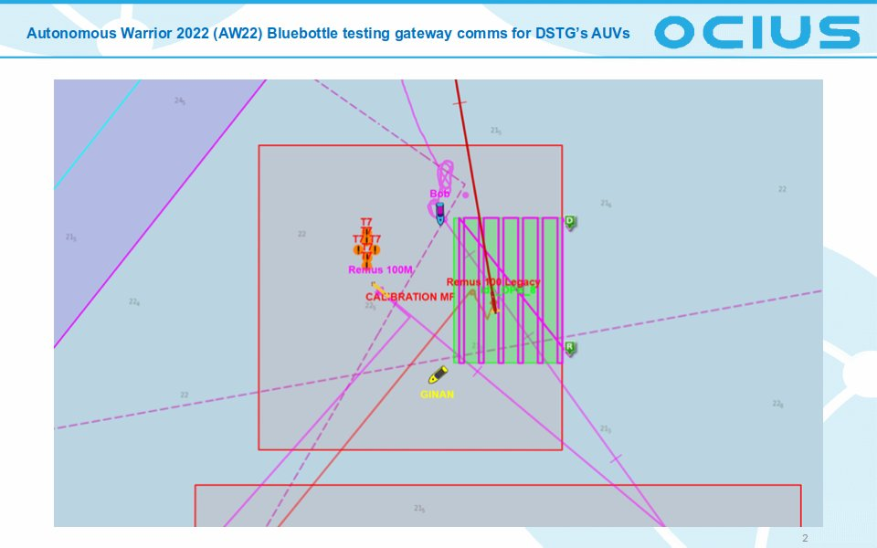

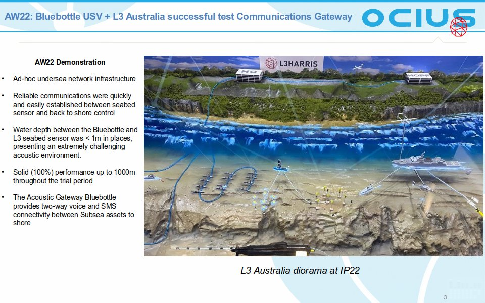

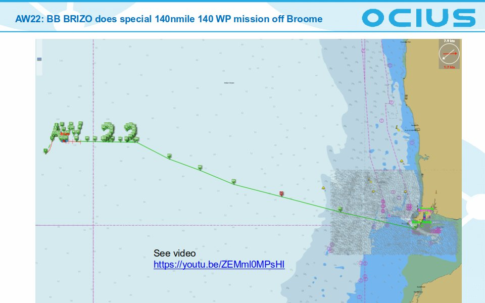

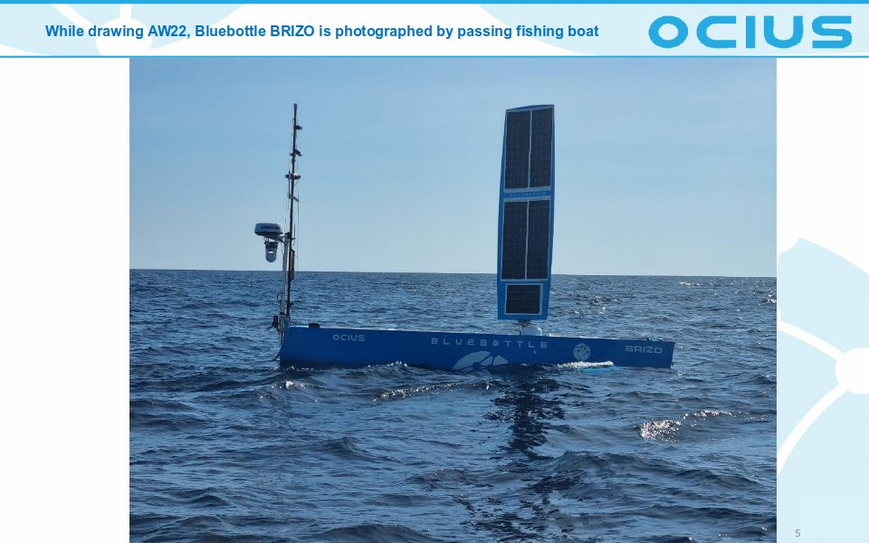

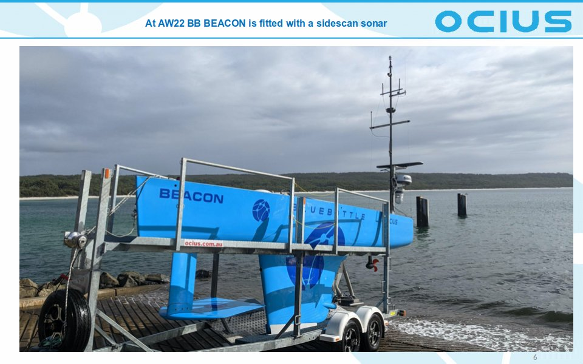

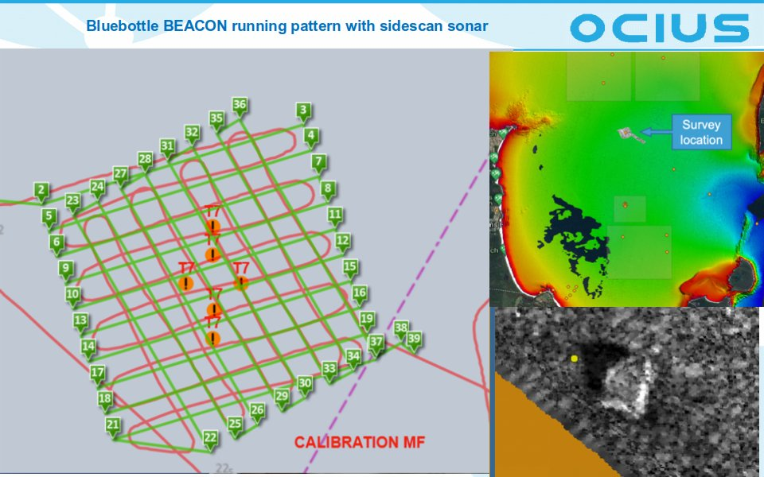

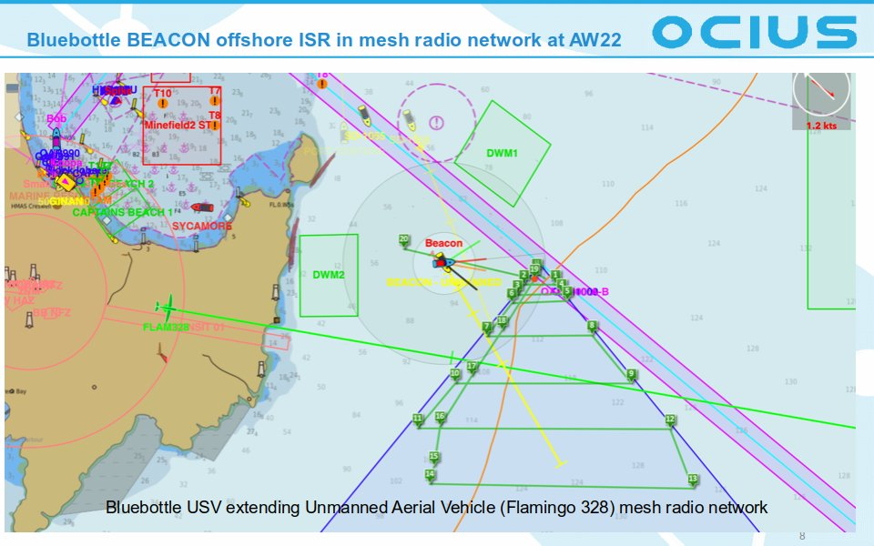

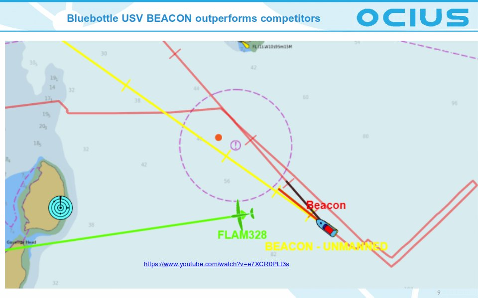

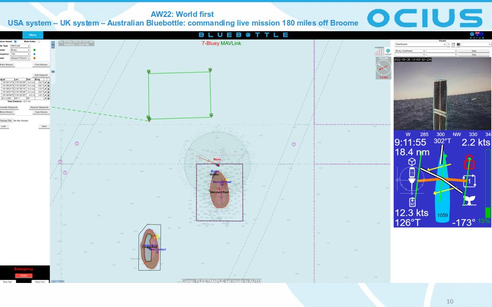

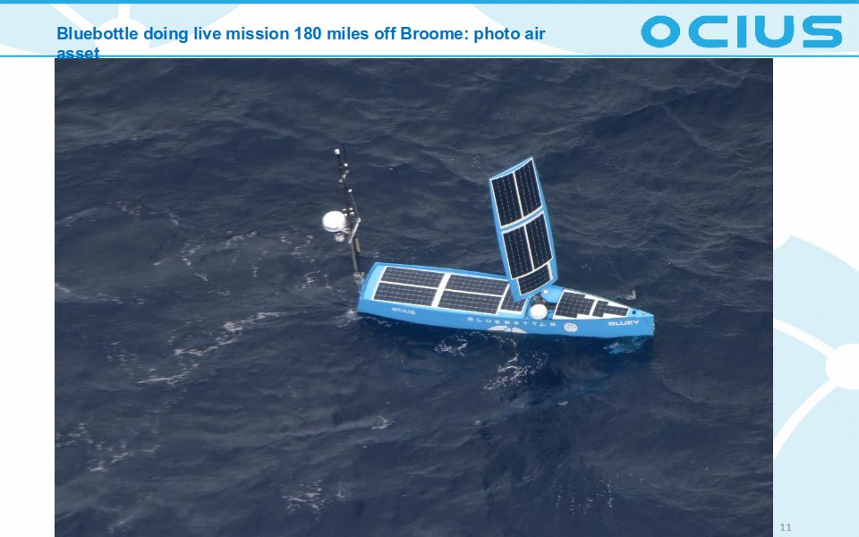

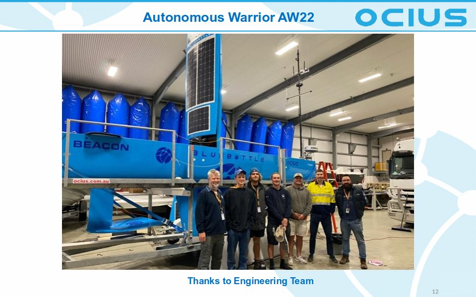

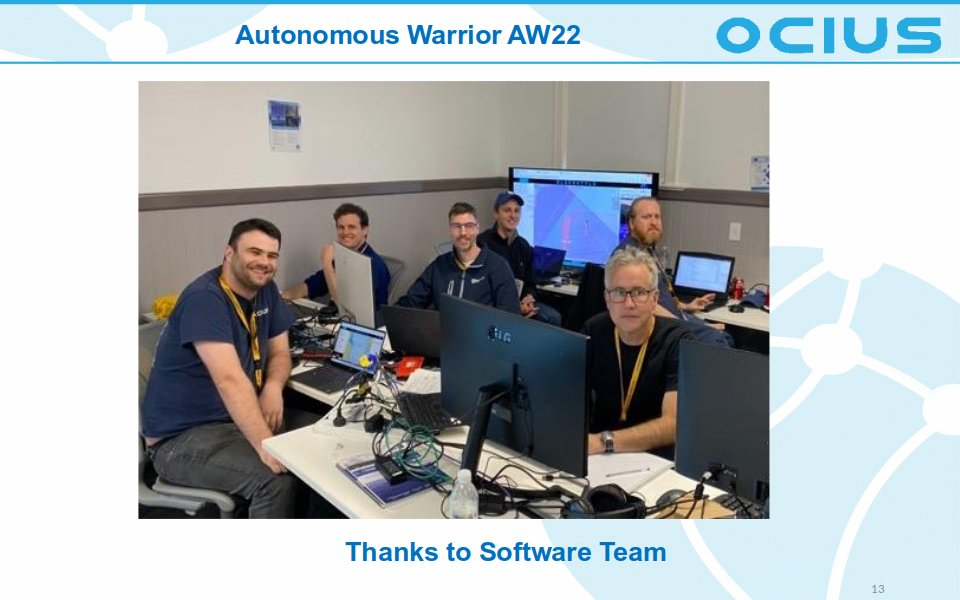

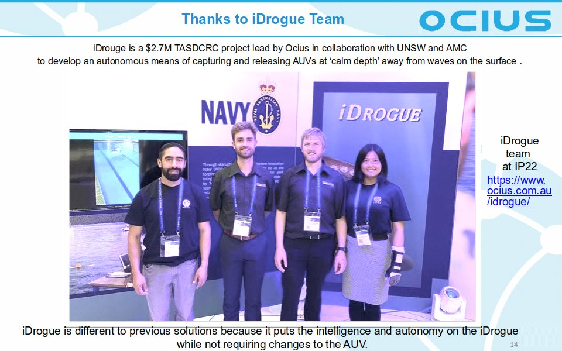

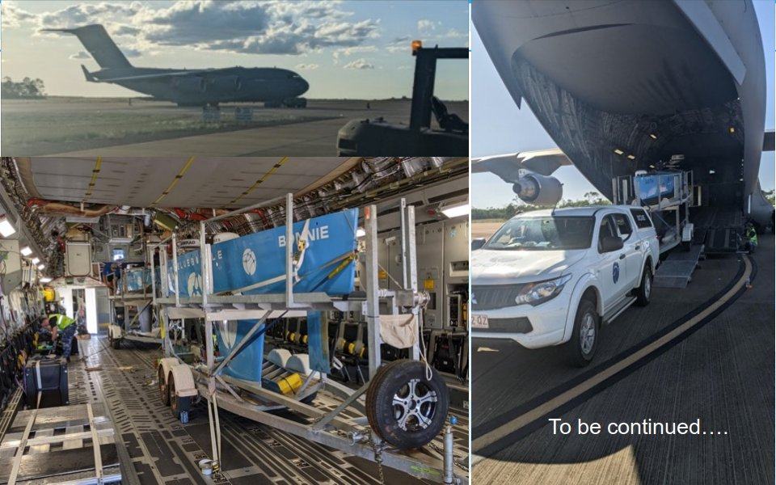

Videos
------

[Filling the Gap Between a Crewed Ship and Nothing](https://youtu.be/LUdWvd2uMyQ)

[Can Bluebottles navigate in strong currents?](https://youtu.be/e7XCR0PLt3s)

[Drawing AW22](https://youtu.be/ZEMml0MPsHI)

[iDrogue Development Early 2022](https://youtu.be/VC08YMhyud0)

[iDrogue Concepts of Operations](https://youtu.be/B8LysXqq-98)

[Exercise Autonomous Warrior wraps up](https://www.youtube.com/watch?v=rYwMKviAZK8)

[ASPI launch of defence budget report](https://youtu.be/6z7igiPI4_U?t=1665)

