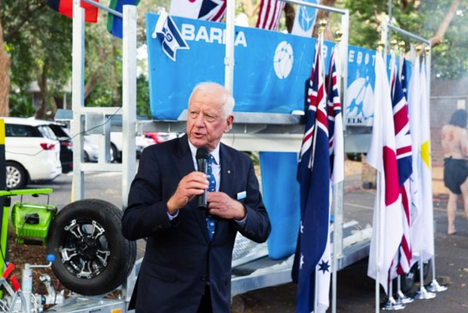
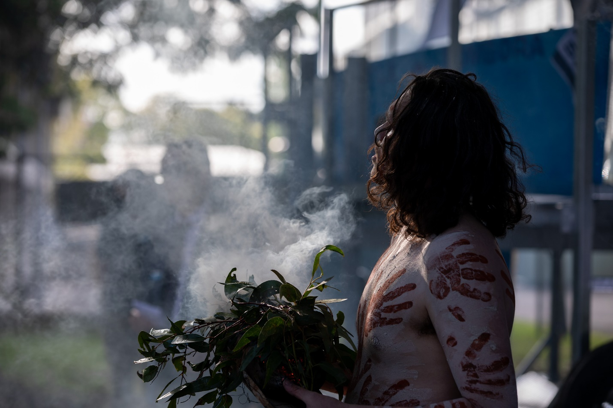

<h1 style="text-align: center;">Royal Australian Navy announces contract to acquire five Bluebottle USVs at Christening of BARRA and BOMBORA</h1>

<h2>Ocius signs contract with RAN to acquire five Bluebottle USVs this financial year</h2>

At a Christening ceremony following the Annual General Meeting of Ocius held on Thursday 24 November 2022, RADM Pete Quinn Head of Navy Capability made the announcement.

He said “Over five years as HNC it has been fantastic being involved with Ocius and seeing Australian technology at the forefront. Systems like Ocius Bluebottles are really important to our strategy. We have vast areas we need to patrol, and we have to and will be investing in uncrewed platforms that will be out there persistently conducting surveillance.”

<i>Mike Galvin Chief Operating Officer Ocius, RADM Pete Quinn AM CSC HNC RAN, Robert Dane CEO Ocius, Commodore Darron Kavanagh AM CSC RAN DG Warfare Innovation Navy and Chris Jenkins Thales Director</i>

Ocius CEO, Robert Dane said “This contract makes Ocius a Defence Prime; not a big one… but from little things big things grow” and “to be a long-lasting Defence Prime we need two things - innovative products and people”. 

He went on “Any innovative product will one day not be innovative - it will become the benchmark so Ocius must have continuous innovation of our Bluebottles, iDrogue, Loyal Shipmate and other products and create a culture where our people, University of NSW academics and subcontractors feel the excitement of innovation.”

Robert also noted that in the last 15 months, five Bluebottles under a Defence Innovation Hub contract had completed nearly 23,000 nautical miles at sea which was equivalent to around the world at the equator. 

<h2>Christening of Hulls # 8 BARRA and # 9 BOMBORA</h2>
Ocius shareholders and staff were joined by RAN, UNSW and Industry partners to celebrate the Christening of two Bluebottles BARRA and BOMBORA.  

Former Chief of Defence Forces, Chief Air Marshall Mark Binskin AC was also an honoured guest.

<i>Mike Galvin Ocius COO welcoming guests and the Welcome to Country</i>

 

<i>Mark Bethwaite AM Ocius Chair, introducing VIPs</i>

 

<i>RADM Pete Quinn making the announcement</i>

 

<i>Ocius CEO, Robert Dane thanking Admiral Quinn and CDRE Kavanagh</i>

 

<i>Chris Jenkins ex CEO of Thales, christening BARRA</i>

 

<i>RADM Lee Goddard christening BOMBORA</i>

 

<i>Smoking Ceremony blessing Bluebottles BARRA and BOMBORA</i>

