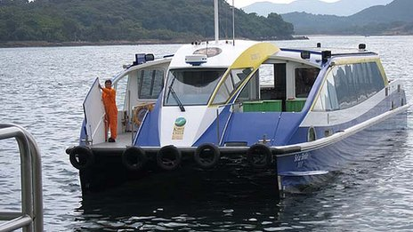
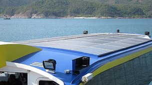
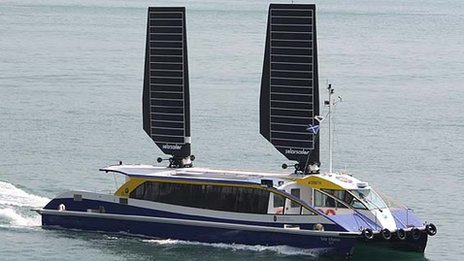
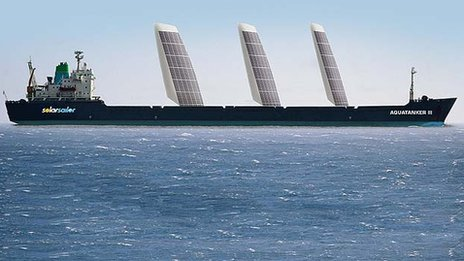
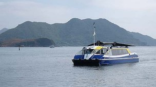

Original article by Katie Hunt Business reporter, BBC News, Hong Kong on 24th Jan 2012 [available here](http://www.bbc.co.uk/news/business-16686260)

From a distance, the yellow-and-blue ferry docking at the pier resembles the scores of other vessels that hop between Hong Kong’s outlying islands and the peninsula every day.

But a closer look as passengers disembark, reveals a grid of gleaming solar panels on the ferry’s roof and, instead of the usual throbbing engine noise, there is a barely audible buzz.

The Solar Eagle and three similar vessels shuttle golfers to tee off on an 18-hole island course. Together they form the world’s first hybrid powered ferry fleet and a commercial proving ground for technology that could transform the future of marine travel.

The technology, similar to that used in hybrid cars, has been developed by an Australian company called Solar Sailor.

Electricity created by the solar panels and stored in a battery powers the engine while the vessel comes in and out of the harbour. Once out in the open ocean and a faster clip is required, the diesel kicks in.

One of the fleet, the Solar Albatross, sports two sails covered in solar panels that can be raised to harness both the sun and the wind to further reduce reliance on fossil fuel.

Robert Dane, Solar Sailor’s founder, says that the technology offers ship owners huge fuel savings and has the potential to be used on all types of vessels from humble ferries and luxury super-yachts to bulk carriers shipping iron ore and navy patrol ships.

“I think in 50 to 100 years, all ships will have solar sails,” he says.

“It just makes so much sense. You’re out there on the water and there’s so much light bouncing around and there’s a lot more energy in the wind than in the sun.”

#### Teething problems

Three of the ferries began operation in 2010 and the Solar Albatross began carrying passengers last year. The solar-sail technology is also in use in two ferries in Shanghai and Sydney.

The Hong Kong Jockey Club, which runs the golf course on Kau Sai Chau island, says its has seen “significant fuel savings” but was still monitoring the overall performance of the ferries.

Mr Dane says that on the golf course-run, the hybrid technology saves 8% or 17% on the fuel bill, depending on the route taken. However, repair and maintenance costs have been more than anticipated.

“The Jockey Club is a new operator so there’s a learning curve for them and the new technology,” he says.

Despite the teething problems, Mr Dane is confident of future sales.

He says he is in the “early stages” of discussions with the operators of Hong Kong’s iconic star ferry, which has been shuttling across Victoria Harbour since 1880, about fitting solar panels on one of their vessels.

And in Australia, he hopes to clinch deals this year with the operator of a river ferry and install the technology on two ocean research vessels.

There are other solar-powered ships in operation such as the catamaran Turanor PlanetSolar, which is circumnavigating the globe exclusively by harnessing the power of the sun. However, Mr Dane says the technology developed by his company is the most commercially tested.

More ambitiously, Mr Dane says the company will soon announce a trial with an Australian mining company to attach a 40m (130ft) tall solar sail to a newly built bulk carrier that will ship iron ore and other raw materials to China.

Solar Sailor is in talks with an Australian mining company about installing a solar sail on a bulk carrier that transports iron ore and other raw materials.

He likens the sail to a “giant windmill blade” that would be covered in solar panels and fold down into the vessel when it is docking and transferring cargo.

By harnessing the wind, the company estimates that the giant sail could shave 20% to 40%, or around A$3m (£2m; $3.1m), off a ship’s annual fuel bill when travelling at 16 knots (18mph), with the solar panels contributing an extra 3% to 6% saving.

“The systems were are installing are worth around A$6 million and therefore the return of investment would be a couple of years at the current oil price,” he says.

“It’s not a matter of if we’re going to do it, it’s a matter of how – right now we are working out the details.”

#### Green oceans

If, as Mr Dane hopes, the technology is adopted more widely, it also has the potential to clean up the shipping industry, which environmental campaigners claim emits more greenhouse gases than commercial aviation.

Roughly 50,000 ships carry 90% of the world’s trade cargo, and these ships tend to burn a heavily polluting oil known as bunker fuel.

“It’s like tar, you have to heat it up to make it liquid so it will flow,” says Mr Dane.

“These incredibly powerful engines run on incredibly cheap but dirty fuel so what we can do in the short-term is to ensure they use less fuel.”

The industry has proved hard for governments to regulate as it does not fall into one jurisdiction, however the United Nations International Maritime Organization has recently introduced new regulations on fuel efficiency and sulphur emissions that could drive demand for Solar Sailor’s technology.

Mr Dane is optimistic about the company’s future even though after more than a decade of doing business it has yet to turn a profit.

He says the company will in future focus on areas less affected the global economic downturn such as defence, with plans afoot to use the technology in unmanned ocean vehicles that could replace navy patrol boats.

“We know (our technology) works. We know the return on investment but there’s been factors outside our control like the economic environment that have inhibited what we are doing,” Mr Dane says.

“We think we’re at a very exciting point with regards to profitability and one of the projects (we’re working on) will make us incredibly profitable in 2012.”
