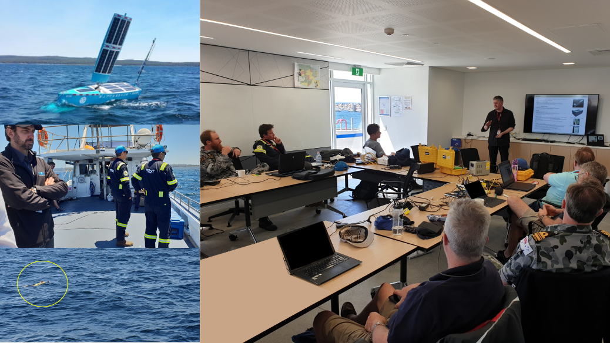
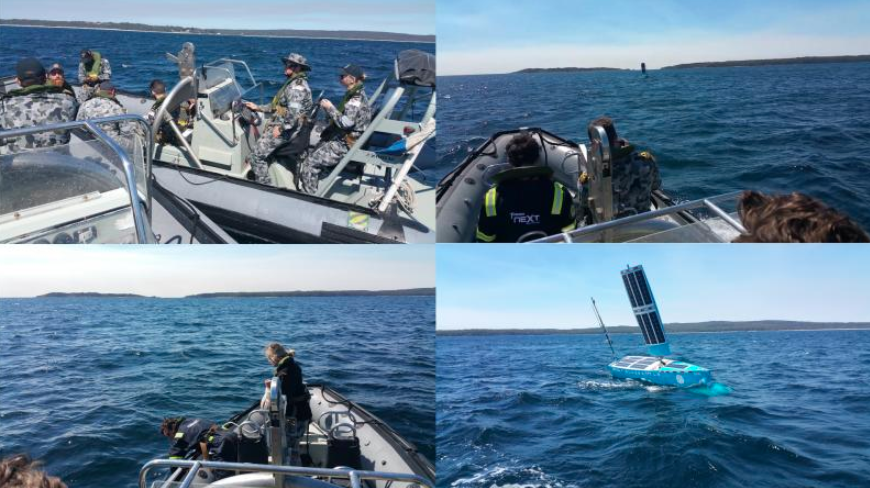
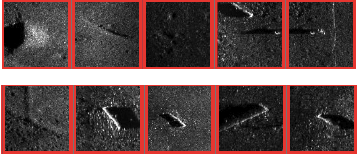
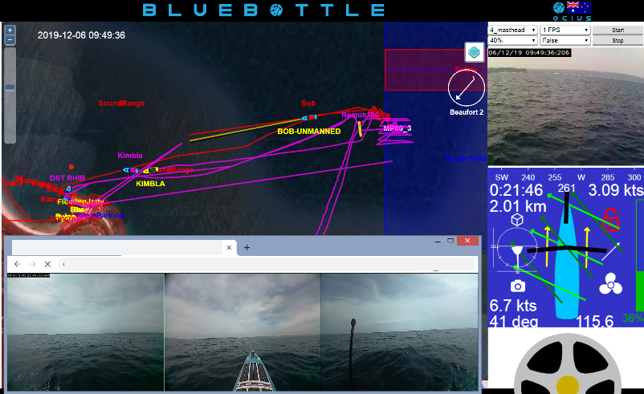
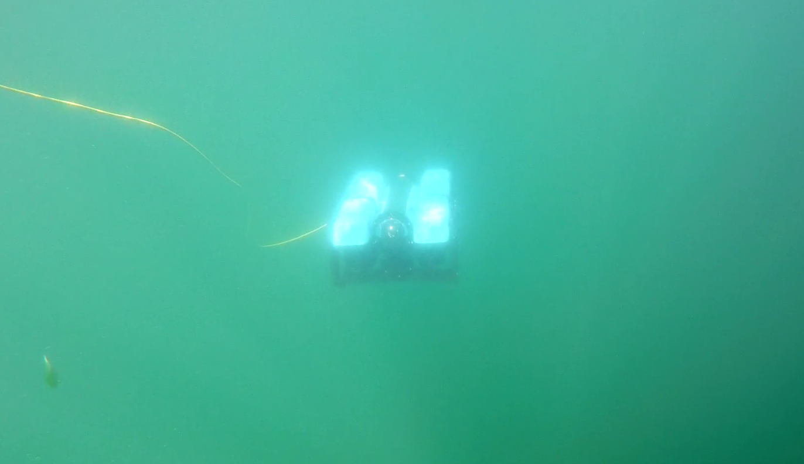

# OCIUS + DST Underwater Group achieve Australian first at Summerfest 2019.

From Dec 2 - Dec 6, we attended ‘Summerfest 2019’, marine autonomy trials at HMAS Creswell, driven by a collaboration between DSTG, RAN, academia and industry.

____

____

The aim of ‘Summerfest’ was to demonstrate the enhanced speed of Maritime Autonomous Systems (MAS) mine hunting and disposal by allowing activities that are currently conducted in series, with delays for data handling and analysis, to happen in parallel.  This involved automated target recognition (ATR) running in real-time on mine hunting systems cueing other systems for classification, identification and disposal as soon as suspect objects were discovered.

In an Australian first, DSTG and Ocius demonstrated remote mine hunting. A Bluebottle Unmanned Surface Vessel (USV) was tasked over a minefield as a ‘Communications Gateway’ relaying information and data between a DST Remus Autonomous Underwater Vehicle (AUV) in the minefield and a manned vessel, MV Kimbla, standing off at a safe distance. The Automatic Target Recognition (ATR) on the Remus AUV was able to report positions of mine contacts immediately via the acoustic relay on the Bluebottle USV, back to the command and control (C2) centre.

The DST Remus AUV then surfaced and sent snippets of sidescan sonar data representing the ATR contacts via WiFi to the Bluebottle USV and then back to the C2 centre whilst the Remus AUV was still in the water over the minefield.

The human operators at the Command and Control (C2) centre or HQ were then able to re-task the Remus AUV via the Bluebottle USV, with ‘reacquire’ missions based on the operator’s analysis of the ATR snippets. 

# Technical Achievements:
* Escorted AUVs from a safe point to the edge of the active mine hunting zone
* Enabled operators to instruct the AUV to enter the active mine hunting zone and conduct a search using sidescan sonar with ATR enabled
* Enabled HQ to see the mine-like contacts reported by the AUV
* Allowed the operators to remotely view the live status of the vehicle when it was on the surface via a network link through the USV, allowing HQ to restart or reconfigure the vehicle and change its mission

The trials at ‘Summerfest’ demonstrated the feasibility of rapidly passing images of contacts detected automatically by AUVs to human analysts situated at a remote distance from the mine field, allowing the humans to select contacts for further action. This is potentially an important step in achieving trusted autonomy.

We’d like to thank Stuart Anstee, Neil Tavener and Phil Chapple from DST Underwater Group Eveleigh for their support, including ‘embedding’ one of their engineers, Russ Webber, in our team at our R&D facility at UNSW for the last month. This Mine Counter Measures (MCM) workflow was a major achievement and built on work we have been doing together since before AW18 Wargames in Nov 2018.
We’d also like to thank all the observers and industry participants. I think we showed that Navy, DST Group and Industry working together collaboratively can definitely speed the innovation cycle. 

Particularly, we’d like to thank Lieutenant James Keane, RAN, who organised this event. James has been doing research in autonomous underwater vehicle homing and was recipient of this year’s Holthouse Memorial Scholarship. 

Finally, we’ve had such positive feedback from this compilation video we made for Pac 2019 that if you missed it, please see below.

<iframe width="100%" height="390" src="https://www.youtube.com/embed/7vhvKcc-UPk" frameborder="0" allow="accelerometer; autoplay; encrypted-media; gyroscope; picture-in-picture" allowfullscreen></iframe>

We wish you a Merry Christmas and look forward to updating you again soon in 2020.