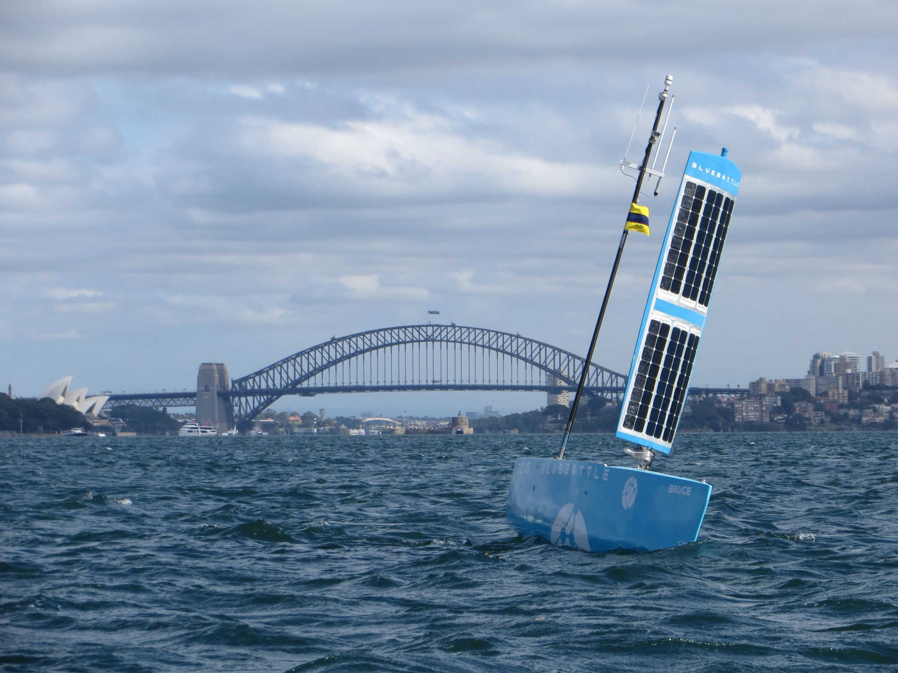

> “The R&D rebate has accelerated our research and development efforts. We have to develop and design both hardware and software that work together. For the persistent ocean robot ‘Bluebottle’ design, it has allowed rapid scale model tank testing through to trials of working prototypes in the sea. For our autonomous command and control software, it has allowed us to employ THREE more people in-house plus work closely with excellent researchers at the UNSW Computer Science Department.” **– Robert Dane, CEO.**

Oceans play an integral role in our lives, influencing weather and climate patterns and providing a home for many species that are essential to our survival. OCIUS’ unmanned surface vessels make it easier for us learn about ocean life.

Innovation and improvement through research has been at the heart of OCIUS’ existence since Day 1\. Initially, a start-up which built ferries that ran on renewable energy, OCIUS has since leveraged its technology to build unmanned surface vessels in response to market demand. OCIUS now builds robots, powered by solar, wind and wave energy that can go out in the ocean for an indefinite period…

[**Read the full by the the Australian Department of Business here** ](https://www.business.gov.au/assistance/research-and-development-tax-incentive/customer-stories/ocius-technology-a-revolutionary-wave-in-ocean-monitoring)
