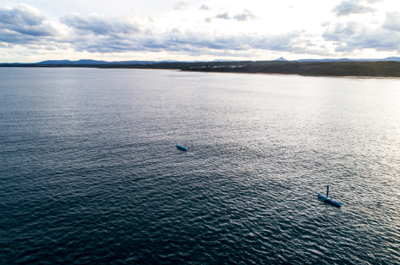

Dear Shareholders of Ocius, Friends and Colleagues,

I am very pleased to report that our Bluebottle Uncrewed Surface Vessels (USVs) have successfully completed all our sea trial requirements for our Defence Innovation Hub contract, three months ahead of schedule.

An important final test was demonstrating our “visual acuity target recognition and collision avoidance” software. In these scenarios, we put a Bluebottle (BB) on a collision course with the Ocius support boat, a difficult to see, low to the water, small, rigid hull inflatable boat (RHIB):

1. Using automatic visual recognition, the RHIB was identified as ‘not water/not sky’ and then positively identified as a ‘speedboat’ 
2. The collision avoidance controller software then plotted a course around the RHIB 
3. The Bluebottle proceeded around it and continued on its way

This all happened autonomously such that if the BB did not have communications at the time, it would avoid the collision and when comms came back it would send photos and GPS to the rest of the team and to the ‘human on the loop’.

```grid|3


```

Most of the endurance and intelligent networking trials over the last 8 weeks have been done in Beaufort 1 - 4 conditions. However, on Sunday 16th June, we had the opportunity to test our sailing and rudder flipper in a Beaufort 5 - 6 Southerly winds and 1 knot Northerly currents for 24 hours. We were able to navigate freely in both ‘sail only’ mode at one point going up to 5 knots boat speed and in ‘rudder flipper only’ mode at up to 2 knots boat speed - both modes using zero propeller power.


I would like to acknowledge our Ocius engineers in Sydney and Ulladulla. Over a marathon 8 weeks, often working round the clock in shifts as the ‘human on the loop’, this team combined their different skills to achieve an outstanding result. Thank you and congratulations on a job well done.

Over the next month we’ll be analysing the logs, writing up our reports, continuing performance experiments on our unique patented ‘rudder flipper’ and taking some well-earned holidays.

In the recent trials, the ‘rudder flipper’ performed above expectations, giving boat speeds using wave power of between 0.5 – 1.5 knots v’s the seas and 1-3 knots with the seas - in everything from Beaufort 1- 6. However, we think there is room for improvement, so we’re experimenting with some different flipper designs, before more endurance testing starting on 22 July.

We will also be attending Robocup (robot soccer) World Championship 2019 at Darling Harbour. This runs from 2-8 July 2019, during which hundreds of teams from around the globe will compete across 10 leagues.  Our computer science friends at University of NSW and University of Newcastle hope once again to lift the championship trophy and we wish them well. Events are open to the public, so for those interested please give me a call.

Again, we’d like to thank AMSA, Transport NSW, local fisherman and local mariners. Particularly we’d like to thank Ulladulla Marine Rescue and their Unit Commander Dave Hall for all their help in these trials. He kindly put together this short video as a record. See https://youtu.be/hdDNF1PueXg.



We look forward to updating you again soon.

Robert Dane CEO
