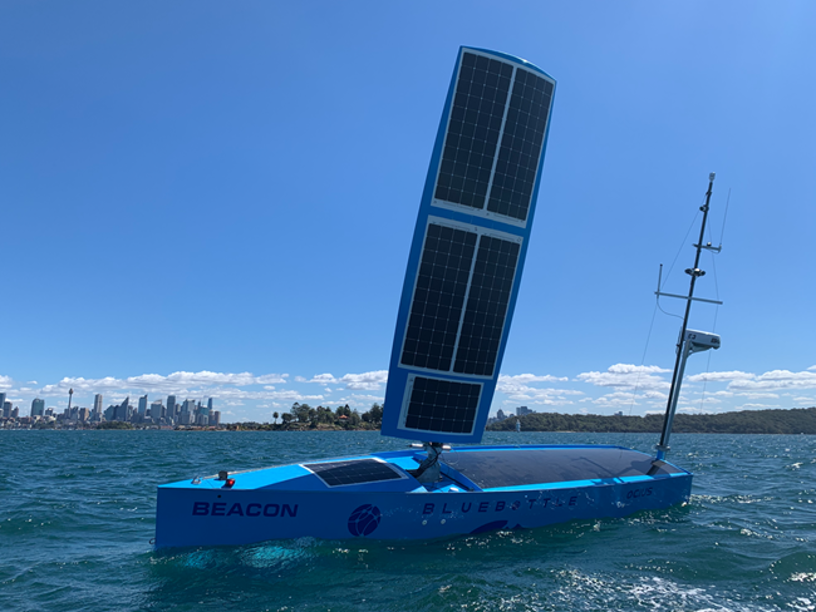
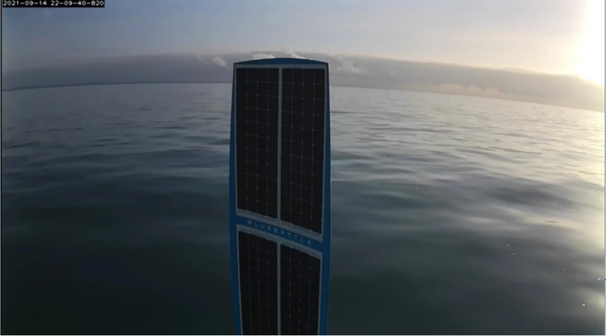
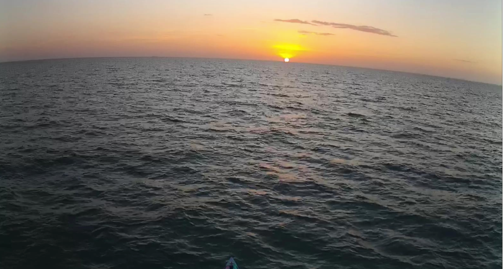
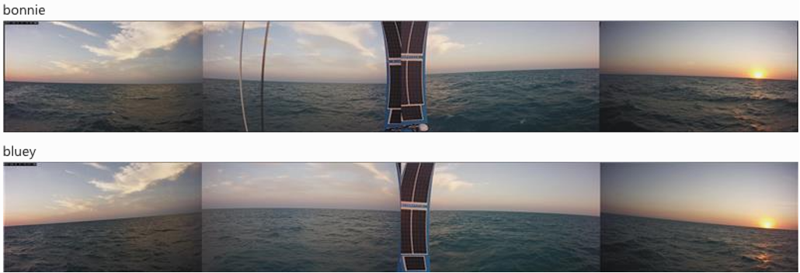
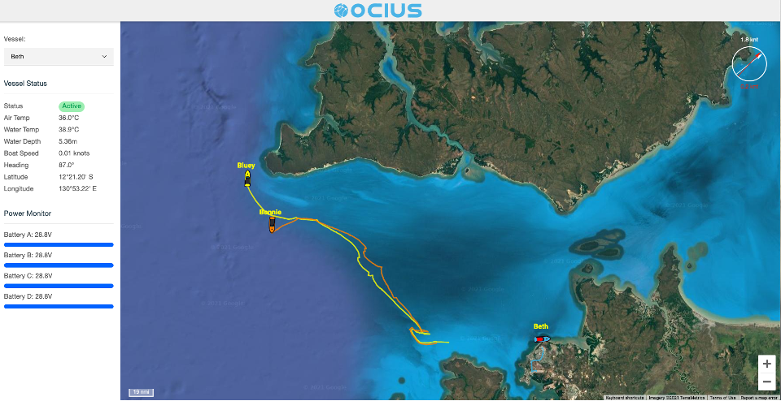
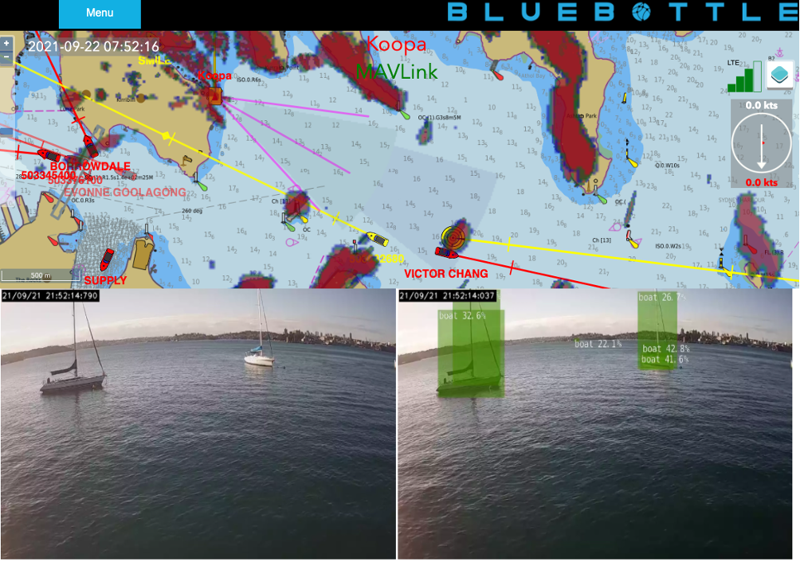
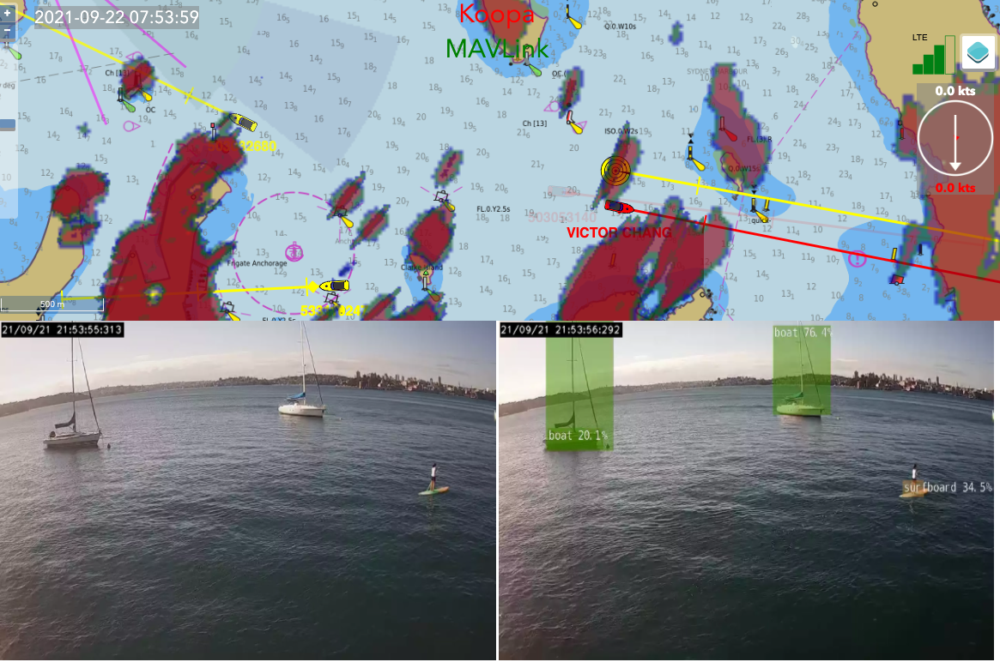

Dear Shareholders, Friends and Colleagues,

Since our Christening ceremony on 18 June 2021, we have been commissioning and testing our boats at our UNSW Randwick Campus facility with staff practising COVID safety, working in shifts and working from home. As the Botany Bay boat ramp is in a Local Government Area that is shut down, we have been launching and recovering out of Sydney’s Rose Bay and testing around a wave buoy four nautical miles off Dee Why.

Meanwhile, thanks to the NT Government and their Defence team, we have four engineers processed through the Howard Springs facility. With the great co-operation of HMAS Coonawarra, Norship and NT Port Authority, we have been testing our Bluebottles in an area south of Tiwi Island, gaining experience in what we might expect compared to NSW.

Issues we need to deal with will include:
- Range of 4G communications
- Strong tides, currents, and murky waters
- High water temperatures, tropical heat, and condensation 
- Logistics & procedures & safety including crocodiles!
- Cyclones

At any time, you can see where the boats are on the LIVE page on our website [https://www.ocius.com.au/live](https://www.ocius.com.au/live)

Separately, we’d like to give a huge thank you to the Royal Sydney Yacht Squadron (RSYS) Kirribilli. We have set up an ‘intelligent mast’ on their outer pontoon. This mast has the same sensors as our masts at sea but being located on Sydney Harbour, it encounters varied contacts more frequently. This means our algorithm can ‘learn’ quicker and ‘fuse’ data better from AIS, radar and cameras for the purpose of collision avoidance and detecting and classifying contacts.

Finally, we hope you enjoy this short video of new our 22’ Bluebottle BLUEY sailing off Botany Bay with a new folding prop and new radar mount.

<iframe width="560" height="315" src="https://www.youtube.com/embed/py3V7Vrxk24" title="YouTube video player" frameborder="0" allow="accelerometer; autoplay; clipboard-write; encrypted-media; gyroscope; picture-in-picture" allowfullscreen></iframe>

For all our news, please see our website and I look forward to updating you again soon. Please feel free to ring me anytime.

Robert Dane, CEO. 0413 580 953